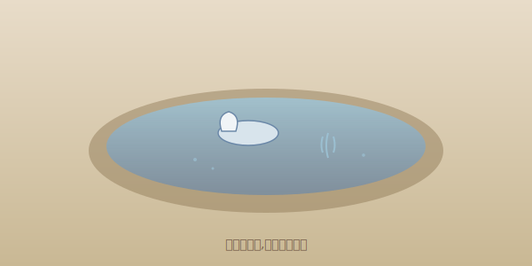

---
title: 关于慢的一句自语
date: 2026-07-02 21:00:00
categories:
  - 纸上漫步
tags:
  - 自语
  - 慢
description: 快是把事情做完,慢是把事情做好。没有谁比谁高级,只是我选了慢。
cover: /images/cover-slow-sentence.svg
---

有人问,慢有什么好。

我想了一会儿,没想出道理。

后来在洗碗的时候想通了——
水从手上过,碗一个个干净,
这个过程不赶,但每只碗都洗到了。

快是把事情做完,慢是把事情做好。
没有谁比谁高级,只是我选了慢。

这一句,写给自己。
