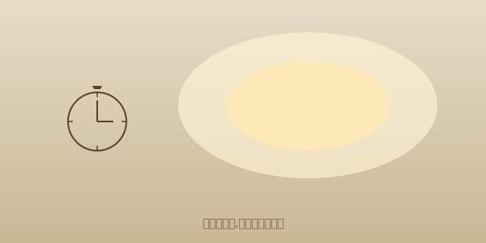

---
title: 闹钟响了三次,我关了三次
date: 2026-07-04 06:50:00
categories:
  - 没有deadline
tags:
  - 思考
  - 时间
description: deadline 都是别人设的,我自己醒来,才是我的时间。
cover: /images/cover-alarm.svg
---

第一次响,我伸手按掉,想再赖五分钟。
第二次响,我翻了个身,窗外好像还没亮透。
第三次响,我直接坐起来,又躺下去。

后来不是闹钟叫醒我的,是阳光。

阳光不催人,它就那么照过来,不急。
我睁眼看它落在墙上,一动不动。

那一刻我想,deadline 都是别人设的。
我自己醒来,才是我的时间。
